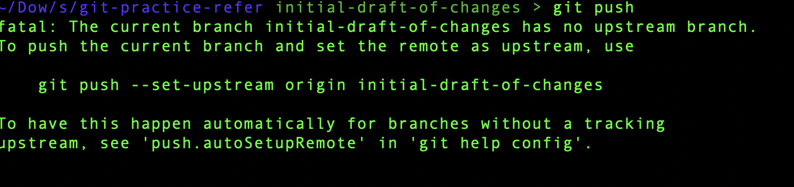

# git-practice-refer

# Here's a step-by-step guide to pull the master branch from GitHub, create a new branch, and push it back to GitHub using Git commands:

cd /path/to/your/repository
git checkout master
git pull origin master
git checkout -b feature/new-feature
# Make changes to files if necessary
git add .
git commit -m "Added a new feature"
git push -u origin feature/new-feature

# Explanation  of above commands --->>>

1. Change Directory to Your Repository
cd /path/to/your/repository
Purpose: Navigates to the directory where your local Git repository is located. This ensures you are working in the correct project folder.

2. Switch to the master Branch
git checkout master
Purpose: Switches your working branch to the master branch.
Details:
master is often the main branch of a repository (although some projects now use main).
You must be on the master branch to ensure you're working with the latest stable code before creating a new branch.

3. Pull the Latest Changes from the Remote Repository
git pull origin master
Purpose: Updates your local master branch with the latest changes from the remote repository on GitHub.
Details:
git pull is a combination of two commands: git fetch (downloads changes) and git merge (integrates those changes into your branch).
origin is the name of the remote repository (default name).
master specifies the branch you want to pull changes from.
4. Create a New Branch and Switch to It
git checkout -b feature/new-feature
Purpose: Creates a new branch called feature/new-feature and switches to it.
Details:
git checkout -b combines the git branch (create branch) and git checkout (switch branch) commands.
feature/new-feature is the name of the branch (you can name it anything meaningful, e.g., bugfix/login-issue or update/docs).
5. Make Changes to Files (Optional)
You would make any necessary changes to your code or files in your local working directory at this step. This could be adding a new feature, fixing bugs, or updating documentation.

6. Add Changes to the Staging Area
git add .
Purpose: Stages all the changes in the current working directory for commit.
Details:
The . means "add all modified, deleted, or new files in the current directory and its subdirectories."
Alternatively, you can stage specific files by replacing . with the file name (e.g., git add file.py).
7. Commit the Changes
git commit -m "Added a new feature"
Purpose: Saves the staged changes to the local repository with a message describing what you’ve done.
Details:
-m allows you to add a commit message inline.
"Added a new feature" should be a concise and meaningful description of the changes made.
8. Push the New Branch to the Remote Repository
git push -u origin feature/new-feature
Purpose: Uploads your new branch (feature/new-feature) to the remote repository on GitHub.
Details:
-u (or --set-upstream) sets the remote branch as the default for future git push and git pull commands.
origin refers to the remote repository.
feature/new-feature is the name of the branch you’re pushing.
After Executing These Commands:
The new branch feature/new-feature will be visible in your GitHub repository under the "Branches" tab.
Collaborators can pull this branch for review or continue development.
You can create a pull request to merge it into the master branch once the feature is complete.

# TODO Change the visibility of private to public and publuc to private in github

 Ctrl + A for -> begining of line
 Ctrl + E for -> End of line  

# What is feature branch ->>>>>>>->>>>>->>>>->>>>->>>>------>>>>--->>>>>

In Git, a branch name like feature/ is used as part of a branch naming convention that helps organize work and make repositories easier to manage. Here's why feature/ is commonly used:

1. Clarity and Organization
feature/ indicates that the branch is for implementing a specific feature in the project.
For example, feature/add-login clearly shows that this branch is for adding a login feature.
It differentiates feature-related work from other types of branches like bugfix/, hotfix/, or release/.
2. Collaboration-Friendly
Teams often work on multiple features simultaneously. Using feature/ ensures everyone knows what each branch is meant for.
It avoids confusion by grouping related work into categories.
3. Works with Git Workflows
In Git workflows like Git Flow, naming conventions like feature/, hotfix/, and release/ are essential:

Git Flow is a branching model where:
master (or main) is the stable production branch.
develop is used for integration and preparing for releases.
feature/ branches are created for individual tasks or features, and they merge back into develop.
4. Ease of Tracking
A clear prefix like feature/ helps track branches in tools like GitHub, GitLab, or Bitbucket.
Branch lists are easier to filter and read.
Example Branches in a Project:
feature/user-authentication (adding user authentication)
feature/dashboard-stats (building the dashboard statistics)
bugfix/fix-404-error (fixing a specific bug)
release/v2.0 (preparing for a release)
In Summary:
The feature/ prefix is not required by Git itself but is a convention adopted for better organization, collaboration, and workflow compatibility. It helps maintain clarity in a collaborative development environment.

# Difference Between git checkout and git pull --->>>

git checkout and git pull are two distinct Git commands, and they serve entirely different purposes. Here's a clear breakdown:

1. git checkout: Switch Branches or Restore Files
Purpose:

Used to switch to a different branch or commit in your local repository.
Can also restore specific files to a previous state from a commit or branch.
Key Uses:

Switch to an Existing Branch:
git checkout branch-name
Changes your working directory to reflect the specified branch.
Does not fetch updates from the remote repository.
Create and Switch to a New Branch (Older Syntax):
git checkout -b new-branch-name
Creates a new branch and switches to it (equivalent to git switch -c new-branch-name).
Restore a File:
git checkout commit-hash -- file-name
Reverts a specific file to its state in the specified commit.
2. git pull: Fetch and Merge Updates from a Remote Repository
Purpose:

Combines git fetch and git merge into one step.
Updates your local branch with the latest changes from the corresponding remote branch.
Key Uses:

Update the Current Branch:
git pull origin branch-name
Fetches the latest changes from the origin remote and merges them into your current local branch.
Ensures your branch is synchronized with the remote branch.
Key Differences:
Feature	git checkout	git pull
Primary Use	Switch branches or restore files.	Fetch and merge changes from the remote repository.
Remote Repository	Does not interact with the remote.	Interacts with the remote to retrieve updates.
Local Changes	Does not update your local branch with remote changes.	Updates your branch by merging remote changes.
Branch Creation	Can create a new branch with -b or switch to an existing branch.	Does not create branches; only syncs changes.
Combination with Remote	Typically used locally to manage branches or files.	Directly interacts with the remote repository.

### 4. **Preserving Links, Images, and Tables**

For links:
```
Example Workflow:
Switch to a Branch:
git checkout master 
Update the Branch with Remote Changes:
git pull origin master
Pulls the latest changes from the origin remote branch master and merges them into your local master.

```
Summary:
Use git checkout to switch between branches or restore files.
Use git pull to update your branch with the latest remote changes

# Staging in Git --->>>
How Staging Works in Git
Working Directory (Untracked/Modified Files):
This is your local workspace where you make changes to files.
Files in this area are not yet tracked or prepared for a commit.
Staging Area (Index):
When you stage a file, you're telling Git, "These changes are ready to be committed."
Only staged changes are included in the next commit.
Think of it as a "to-do list" for Git.
Repository (Committed Changes):
After you commit, the changes from the staging area are saved into your local repository.


# Difference Between git push -u origin feature/new-feature and git push --->>>>>
1. git push -u origin feature/new-feature
What it Does:

Pushes a Branch to a Remote Repository:
Pushes the current branch (in this case, feature/new-feature) to the remote repository named origin.
Creates the branch on the remote repository if it doesn’t already exist.
Sets the Upstream Tracking Branch:
The -u or --set-upstream flag sets the upstream tracking branch for the local branch.
This links your local branch (feature/new-feature) to the remote branch of the same name (or the one specified).
After this, you can simply use git push or git pull without specifying the branch name.
When to Use It:

When you're pushing a branch for the first time to the remote repository.
When you want to establish a tracking relationship between your local branch and a remote branch.
Example Workflow:

# Create a new branch and switch to it
git checkout -b feature/new-feature

# Make changes, stage, and commit
git add .
git commit -m "Implemented a new feature"

# Push the branch and set upstream
git push -u origin feature/new-feature
After running this, your local feature/new-feature branch will be tracked by the remote feature/new-feature branch.
Now you can use the simpler git push and git pull commands for this branch in the future.
2. git push
What it Does:

Pushes the changes from the current branch to its upstream branch (if one is already set).
It requires an upstream branch to already exist or be previously configured with git push -u.
When to Use It:

After the upstream branch has been set (e.g., with git push -u or via other commands).
To push changes from your local branch to the remote branch without re-specifying the branch and remote.
Example Workflow:

Assuming the upstream branch is already set:
git push
This pushes the current branch to its corresponding remote branch.
If no upstream branch exists, Git will display an error:
fatal: The current branch feature/new-feature has no upstream branch.
To push the current branch and set the remote as upstream, use:
    git push --set-upstream origin feature/new-feature
Key Differences in  Markdown format for .md files


| **Command**                  | **What It Does**                                                                                   |
|------------------------------|---------------------------------------------------------------------------------------------------|
| `git push -u origin branch`   | Pushes the branch to the remote repository and sets it as the upstream for the local branch.       |
| `git push`                    | Pushes the current branch to the already-configured upstream branch (fails if no upstream exists). |


Why Use -u for the First Push?
Simplifies Future Pushes:
Once the upstream is set, you no longer need to specify the remote and branch every time.
Instead of git push origin feature/new-feature, you can just use git push.
Tracks Remote Branch Automatically:
The upstream tracking ensures that git pull and git push automatically operate on the correct remote branch.
Summary
Use git push -u origin feature/new-feature the first time you push a new branch to the remote.
After that, use git push for subsequent updates to that branch.

---
